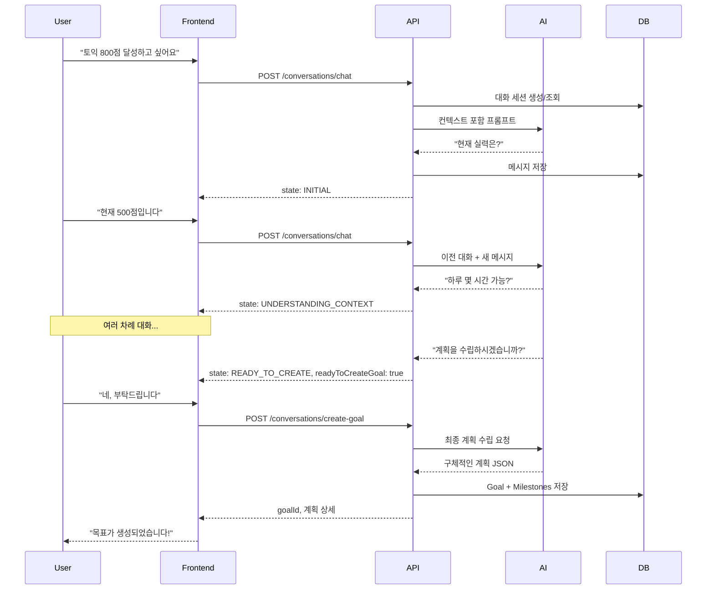

# JJA-JO API 명세서 (Swagger 형식)

## 📋 API 개요

- **Base URL**: `http://localhost:8080`
- **API Version**: v1.0.0
- **AI 엔진**: Google Gemini 2.0 Flash (Experimental)
- **인증 방식**: Gemini API Key (헤더: `X-API-Key`)
- **응답 형식**: JSON

### ⚠️ 중요: OpenAPI vs Gemini API

| 용어 | 설명 |
|------|------|
| **Gemini API** | Google의 생성형 AI - 실제 AI 기능 제공 ✅ |
| **OpenAPI/Swagger** | API 문서화 표준 - 이 문서 생성용 📄 |

---

## 🔐 인증 (Gemini API Key)

### API Key 발급 방법

1. [Google AI Studio](https://makersuite.google.com/app/apikey) 접속
2. "Create API Key" 버튼 클릭
3. 생성된 키 복사 (예: `AIzaSyD...`)

### 사용 방법

모든 API 요청은 HTTP 헤더에 **Google Gemini API Key**를 포함해야 합니다:

```http
X-API-Key: AIzaSyD...your-gemini-api-key
```

### 보안 주의사항

- ❌ API Key를 코드에 하드코딩하지 마세요
- ❌ Git에 커밋하지 마세요
- ✅ 환경 변수로 관리하세요
- ✅ .gitignore에 추가하세요

---

## 📡 엔드포인트

### 1. 대화형 목표 설정

#### 1.1 대화 시작/이어가기

**POST** `/api/v1/conversations/chat`

AI와 대화하며 목표를 구체화합니다. 여러 차례 대화를 통해 사용자의 목표, 현재 상태, 가용 시간 등을 파악합니다.

**Request Body:**
```json
{
  "userId": "user-123",
  "message": "토익 800점 달성하고 싶어요",
  "conversationId": "optional-conversation-id"
}
```

| 필드 | 타입 | 필수 | 설명 |
|------|------|------|------|
| userId | string | ✅ | 사용자 고유 ID |
| message | string | ✅ | 사용자 메시지 |
| conversationId | string | ❌ | 기존 대화 이어가기 (없으면 새 대화 시작) |

**Response 200:**
```json
{
  "conversationId": "conv-uuid-123",
  "aiMessage": "좋습니다! 현재 토익 실력은 어느 정도인가요?",
  "state": "UNDERSTANDING_CONTEXT",
  "readyToCreateGoal": false,
  "collectedInfo": {
    "mentioned_hours": false,
    "mentioned_days": false
  },
  "messageCount": 2
}
```

| 필드 | 타입 | 설명 |
|------|------|------|
| conversationId | string | 대화 세션 ID |
| aiMessage | string | AI 응답 메시지 |
| state | enum | 대화 상태 (INITIAL, UNDERSTANDING_CONTEXT, COLLECTING_DETAILS, READY_TO_CREATE) |
| readyToCreateGoal | boolean | 목표 생성 준비 완료 여부 |
| collectedInfo | object | 수집된 정보 요약 |

**Error Responses:**
- `401 Unauthorized`: API Key 누락 또는 잘못됨
- `500 Internal Server Error`: AI 처리 오류

---

#### 1.2 대화로부터 목표 생성

**POST** `/api/v1/conversations/create-goal`

충분한 대화 후 (`readyToCreateGoal: true`), 수집된 정보를 바탕으로 구체적인 목표와 일정을 생성합니다.

**Request Body:**
```json
{
  "conversationId": "conv-uuid-123"
}
```

**Response 201:**
```json
{
  "goalId": "goal-uuid-456",
  "title": "토익 800점 달성",
  "description": "3개월 집중 학습 계획\n1단계: 어휘력 강화...",
  "deadline": "2026-04-21",
  "estimatedHours": 120,
  "milestoneCount": 3,
  "message": "목표가 성공적으로 생성되었습니다!"
}
```

**Error Responses:**
- `400 Bad Request`: 대화 ID가 잘못되었거나 준비되지 않음
- `409 Conflict`: 이미 완료된 대화
- `500 Internal Server Error`: 목표 생성 실패

---

### 2. 기존 목표 관리 (기존 API)

#### 2.1 간단한 목표 생성

**POST** `/api/v1/goals/create`

AI와 상담 없이 바로 목표를 생성합니다 (기존 방식).

**Request Body:**
```json
{
  "goalDescription": "3개월 안에 토익 800점 달성하고 싶어"
}
```

---

### 3. AI 채팅 (일정 등록용)

#### 3.1 간단한 일정 추가

**POST** `/api/v1/chat`

간단한 일정을 자연어로 등록합니다.

**Request Body:**
```json
{
  "message": "내일 오후 3시 운동",
  "conversationId": null
}
```

---

## 📊 데이터 모델

### ConversationState (Enum)

대화 진행 상태를 나타냅니다.

| 값 | 설명 |
|----|------|
| INITIAL | 초기 단계 (1-2번째 메시지) |
| UNDERSTANDING_CONTEXT | 컨텍스트 파악 중 (3-4번째 메시지) |
| COLLECTING_DETAILS | 세부 정보 수집 중 (5-6번째 메시지) |
| READY_TO_CREATE | 목표 생성 준비 완료 (7번째 이후) |

### GoalCategory (Enum)

| 값 | 설명 |
|----|------|
| WORK | 업무 |
| STUDY | 학습/공부 |
| HEALTH | 건강/운동 |
| PERSONAL | 개인 |
| HOBBY | 취미 |
| OTHER | 기타 |

### GoalPriority (Enum)

| 값 | 설명 |
|----|------|
| HIGH | 높음 |
| MEDIUM | 보통 |
| LOW | 낮음 |

---

## 🔄 대화형 목표 설정 플로우



---

## 🧪 테스트 시나리오

### Scenario 1: 완전한 대화형 목표 설정

```bash
# 1. 대화 시작
curl -X POST http://localhost:8080/api/v1/conversations/chat \
  -H "Content-Type: application/json" \
  -H "X-API-Key: your-api-key" \
  -d '{
    "userId": "test-user",
    "message": "토익 공부 계획을 세우고 싶어요"
  }'

# 2. 대화 이어가기 (conversationId 사용)
curl -X POST http://localhost:8080/api/v1/conversations/chat \
  -H "Content-Type: application/json" \
  -H "X-API-Key: your-api-key" \
  -d '{
    "userId": "test-user",
    "message": "현재 500점이고, 하루 2시간 정도 공부할 수 있어요",
    "conversationId": "conv-uuid-from-step-1"
  }'

# 3. ... (여러 차례 대화)

# 4. readyToCreateGoal: true가 되면 목표 생성
curl -X POST http://localhost:8080/api/v1/conversations/create-goal \
  -H "Content-Type: application/json" \
  -H "X-API-Key: your-api-key" \
  -d '{
    "conversationId": "conv-uuid"
  }'
```

---

## 📖 Swagger UI 접속

개발 서버 실행 후 다음 URL에서 인터랙티브 API 문서를 확인할 수 있습니다:

**🔗 http://localhost:8080/swagger-ui.html**

- 모든 엔드포인트 테스트 가능
- Request/Response 예시 제공
- 스키마 자동 생성

---

## 💡 설계 철학

### 1. Multi-turn Conversation (다회차 대화)
- 한 번의 입력이 아닌 여러 차례 대화로 목표를 구체화
- AI가 적절한 질문을 통해 필요한 정보 수집

### 2. Context Awareness (컨텍스트 인식)
- 이전 대화 내용을 기억하고 연결성 있는 상담
- 대화 상태(state)를 추적하여 단계별 진행

### 3. User-Centric (사용자 중심)
- 사용자의 상황, 가용 시간, 현재 수준을 충분히 파악
- 강요하지 않고 선택지 제시

### 4. Adaptive Planning (적응형 계획)
- 수집한 정보에 기반한 맞춤형 계획 수립
- 현실적이고 실현 가능한 목표 제안

---

## 🏗️ 아키텍처 요약

```
┌─────────────────────────────────────────────────────────┐
│                    Presentation Layer                    │
│  - ConversationalGoalController                          │
│  - REST API Endpoints                                    │
│  - Request/Response DTOs                                 │
│  - @Valid Validation                                     │
└────────────────────┬────────────────────────────────────┘
                     │
┌────────────────────▼────────────────────────────────────┐
│                   Application Layer                      │
│  - ConversationalGoalService                             │
│  - 비즈니스 로직                                          │
│  - 대화 상태 관리                                         │
│  - AI 프롬프트 생성                                       │
└────────────────────┬────────────────────────────────────┘
                     │
┌────────────────────▼────────────────────────────────────┐
│                    Domain Layer                          │
│  - GoalEntity, ConversationEntity, MessageEntity         │
│  - Repository Interfaces                                 │
│  - 도메인 로직                                            │
└────────────────────┬────────────────────────────────────┘
                     │
┌────────────────────▼────────────────────────────────────┐
│                Infrastructure Layer                      │
│  - JPA Repositories                                      │
│  - H2 Database                                           │
│  - GeminiChatAdapter                                     │
└─────────────────────────────────────────────────────────┘
```

---

## 📝 개발 노트

### 효율성 설계 근거

1. **JPA 엔티티 설계**
   - 인덱스 전략: 자주 조회되는 (userId, status) 복합 인덱스
   - 양방향 관계: 헬퍼 메서드로 관계 동기화 자동화
   - Lazy Loading: N+1 문제 방지

2. **Repository 패턴**
   - Spring Data JPA 메서드 네이밍 규칙 활용
   - 커스텀 쿼리는 @Query로 최적화
   - Fetch Join으로 필요한 경우 즉시 로딩

3. **서비스 계층**
   - @Transactional: 원자성 보장
   - 명확한 책임 분리
   - ObjectMapper로 유연한 JSON 처리

4. **테스트 코드**
   - Mockito로 의존성 격리
   - Given-When-Then 패턴
   - AssertJ로 유창한 assertion

---

## 🚀 다음 단계

1. **프론트엔드 통합**: React 컴포넌트 개발
2. **실시간 알림**: WebSocket으로 AI 응답 스트리밍
3. **추천 시스템**: 협업 필터링 기반 목표 추천
4. **분석 대시보드**: 목표 달성률, 생산성 통계
5. **프로덕션 DB**: PostgreSQL 마이그레이션

---

**📧 문의**: support@jjajo.com  
**📚 문서 업데이트**: 2026-01-21  
**🔖 버전**: v1.0.0
