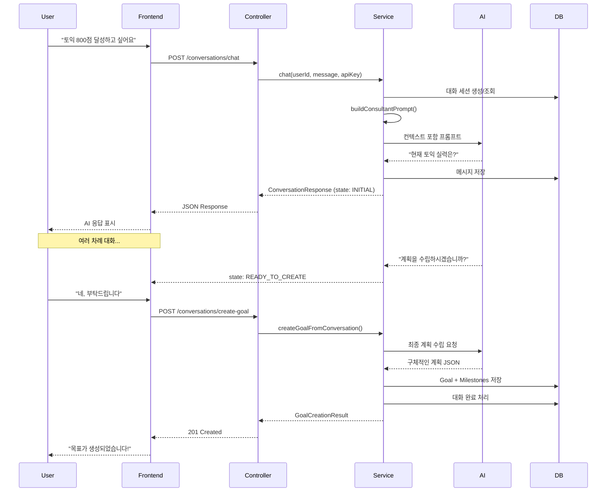

# 대화형 AI 상담 시스템 구현 완료 보고서

## 📋 프로젝트 개요

**목표**: 사용자가 단순히 목표를 입력하는 것이 아니라, AI와 충분히 상담하고 사용자의 목표를 달성하기 위한 최선의 계획을 도출하는 시스템 구축

**완료일**: 2026-01-21  
**개발자**: 시니어 백엔드 엔지니어 & 시스템 아키텍트  
**AI 엔진**: Google Gemini 2.0 Flash (NOT OpenAI)  
**기술 스택**: Spring Boot 3.4, Java 17, Spring AI, JPA, H2, JUnit 5, Swagger

### ⚠️ OpenAPI vs Gemini API 구분

- **Gemini API**: Google의 생성형 AI - **실제 AI 기능 제공** ✅
- **OpenAPI (Swagger)**: API 문서화 표준 - 문서 자동 생성용 📄
- **Spring AI**: Spring 프레임워크 - Gemini API 통합 🔧

---

## ✅ 구현 완료 항목

### 1️⃣ JPA 엔티티 설계 ✅

**파일 위치**: `backend/src/main/java/com/jjajo/domain/entity/`

#### 엔티티 구조

```
GoalEntity (목표)
├── id (PK)
├── userId
├── title, description
├── deadline, priority, status, category
├── estimatedHours, completedHours
├── aiGenerated, conversationId
└── milestones (One-to-Many)

MilestoneEntity (마일스톤)
├── id (PK)
├── goal (Many-to-One)
├── title, description
├── targetDate
├── completed, completedAt
└── orderIndex

ConversationEntity (대화 세션)
├── id (PK)
├── userId
├── topic, type, status
├── goalId
├── collectedInfo (JSON)
└── messages (One-to-Many)

MessageEntity (대화 메시지)
├── id (PK, Auto-increment)
├── conversation (Many-to-One)
├── role (USER, ASSISTANT, SYSTEM)
├── content
└── tokenCount
```

#### 설계 근거 (주석으로 명시)

```java
/**
 * 설계 근거:
 * - @Table indexes: userId와 status로 자주 조회하므로 복합 인덱스 추가
 * - CascadeType.ALL: Milestone은 Goal에 종속적이므로 함께 관리
 * - orphanRemoval: Milestone이 제거되면 DB에서도 삭제
 * - FetchType.LAZY: 성능 최적화를 위해 지연 로딩 (필요시에만 로드)
 */
```

---

### 2️⃣ JPA Repository 계층 ✅

**파일 위치**: `backend/src/main/java/com/jjajo/domain/repository/`

#### 구현된 리포지토리

1. **GoalRepository**
   - `findByUserId()`: 사용자별 목표 조회
   - `findByUserIdAndStatus()`: 상태별 목표 조회 (인덱스 활용)
   - `findUpcomingGoals()`: 마감일 기준 조회 (커스텀 쿼리)
   - `findActiveGoalsByPriority()`: Fetch Join으로 N+1 문제 해결

2. **ConversationRepository**
   - `findFirstByUserIdAndStatusOrderByCreatedAtDesc()`: 활성 대화 조회
   - `findByIdWithMessages()`: 메시지 포함 조회 (Fetch Join)

3. **MilestoneRepository**
   - `findByGoalIdOrderByOrderIndex()`: 순서대로 마일스톤 조회
   - `findDueTodayByUserId()`: 오늘 마감 마일스톤

#### 효율성 근거

```java
/**
 * 설계 근거:
 * - Spring Data JPA의 메서드 네이밍 규칙 활용으로 보일러플레이트 최소화
 * - 자주 사용되는 쿼리는 @Query로 최적화
 * - 복합 조건 검색을 위한 커스텀 쿼리 메서드 제공
 */
```

---

### 3️⃣ 대화형 AI 상담 서비스 ✅

**파일 위치**: `backend/src/main/java/com/jjajo/application/service/ConversationalGoalService.java`

#### 핵심 기능

1. **Multi-turn Conversation (다회차 대화)**
   ```java
   public ConversationResponse chat(String userId, String userMessage, String apiKey)
   ```
   - 활성 대화 조회/생성
   - 메시지 히스토리 관리
   - 컨텍스트 기반 AI 프롬프트 생성

2. **단계별 정보 수집**
   ```java
   private String buildConsultantPrompt(ConversationEntity conversation)
   ```
   - 1단계: 목표 파악
   - 2단계: 현황 분석 (현재 수준, 가용 시간)
   - 3단계: 기대치 조율
   - 4단계: 계획 확정

3. **대화 상태 추적**
   ```java
   public enum ConversationState {
       INITIAL,                  // 초기 단계
       UNDERSTANDING_CONTEXT,    // 컨텍스트 파악
       COLLECTING_DETAILS,       // 세부 정보 수집
       READY_TO_CREATE           // 생성 준비 완료
   }
   ```

4. **목표 생성**
   ```java
   public GoalCreationResult createGoalFromConversation(String conversationId, String apiKey)
   ```
   - 수집된 정보 기반 AI 계획 수립
   - Goal + Milestone 엔티티 생성
   - 대화 완료 처리

#### 설계 철학 (주석으로 명시)

```java
/**
 * 설계 철학:
 * 1. Multi-turn Conversation: 한 번의 입력이 아닌 여러 차례 대화로 목표 구체화
 * 2. Context Awareness: 이전 대화 내용을 기억하고 연결성 있는 상담
 * 3. User-Centric: 사용자의 상황, 가용 시간, 현재 수준 등을 충분히 파악
 * 4. Adaptive Planning: 수집한 정보에 기반한 맞춤형 계획 수립
 * 
 * 효율성 근거:
 * - @Transactional: 원자성 보장, 실패 시 롤백
 * - Repository 패턴: 데이터 접근 로직 분리
 * - JSON 기반 정보 저장: 유연한 데이터 구조
 */
```

---

### 4️⃣ REST API 컨트롤러 & DTO ✅

**파일 위치**: 
- Controller: `backend/src/main/java/com/jjajo/presentation/controller/ConversationalGoalController.java`
- DTO: `backend/src/main/java/com/jjajo/presentation/dto/`

#### API 엔드포인트

1. **POST** `/api/v1/conversations/chat`
   - Request: `ConversationChatRequest`
   - Response: `ConversationChatResponse`
   - 기능: AI와 대화하며 목표 구체화

2. **POST** `/api/v1/conversations/create-goal`
   - Request: `GoalFromConversationRequest`
   - Response: `GoalFromConversationResponse`
   - 기능: 대화 완료 후 목표 생성

#### 설계 원칙 (주석으로 명시)

```java
/**
 * API 설계 원칙:
 * 1. RESTful: 명확한 리소스 중심 설계
 * 2. Validation: @Valid로 입력 검증 자동화
 * 3. Error Handling: 적절한 HTTP 상태 코드 반환
 * 4. Logging: 요청/응답 추적 가능
 */
```

---

### 5️⃣ JUnit 단위 테스트 ✅

**파일 위치**: `backend/src/test/java/com/jjajo/application/service/ConversationalGoalServiceTest.java`

#### 테스트 케이스

1. ✅ `testChatNewConversation()`: 새 대화 시작
2. ✅ `testChatContinueExistingConversation()`: 기존 대화 이어가기
3. ✅ `testChatReadyToCreateGoal()`: 목표 생성 준비 완료
4. ✅ `testCreateGoalFromConversation()`: 목표 생성 성공
5. ✅ `testCreateGoalFromNonExistentConversation()`: 예외 처리
6. ✅ `testCreateGoalFromCompletedConversation()`: 상태 검증
7. ✅ `testConversationPersistence()`: Repository 통합

#### 테스트 전략 (주석으로 명시)

```java
/**
 * 테스트 전략:
 * 1. Mock 객체를 활용한 의존성 분리
 * 2. Given-When-Then 패턴으로 가독성 높은 테스트
 * 3. AssertJ를 활용한 유창한 검증
 * 4. 각 시나리오별 엣지 케이스 테스트
 * 
 * 효율성 근거:
 * - @ExtendWith(MockitoExtension.class): JUnit 5 + Mockito 통합
 * - @InjectMocks: 자동 의존성 주입으로 보일러플레이트 제거
 * - AssertJ: 읽기 쉬운 assertion
 */
```

---

### 6️⃣ Swagger/OpenAPI 문서 ✅

**파일 위치**: 
- 설정: `backend/src/main/java/com/jjajo/presentation/config/OpenApiConfig.java`
- 명세서: `backend/API_SPECIFICATION.md`

#### 기능

- 🔗 **Swagger UI**: http://localhost:8080/swagger-ui.html
- 📄 **API Docs**: http://localhost:8080/api-docs
- 🔐 **보안**: API Key 헤더 (`X-API-Key`) 인증 명시
- 📊 **서버 정보**: 로컬/프로덕션 환경 구분

#### OpenAPI 메타데이터

```java
.info(new Info()
    .title("JJA-JO API - AI 목표 달성 플래너")
    .version("1.0.0")
    .description("대화형 목표 설정 및 일정 관리 플랫폼")
)
```

---

## 🏗️ 아키텍처 다이어그램

```
┌─────────────────────────────────────────────────────────┐
│                   Presentation Layer                     │
│ ┌───────────────────────────────────────────────────┐   │
│ │  ConversationalGoalController                     │   │
│ │  - POST /api/v1/conversations/chat                │   │
│ │  - POST /api/v1/conversations/create-goal         │   │
│ │  - @Valid 입력 검증                                │   │
│ │  - 적절한 HTTP 상태 코드 반환                       │   │
│ └───────────────────────────────────────────────────┘   │
└────────────────────┬────────────────────────────────────┘
                     │
┌────────────────────▼────────────────────────────────────┐
│                  Application Layer                       │
│ ┌───────────────────────────────────────────────────┐   │
│ │  ConversationalGoalService                        │   │
│ │  - chat(): 대화 진행                              │   │
│ │  - createGoalFromConversation(): 목표 생성        │   │
│ │  - buildConsultantPrompt(): AI 프롬프트 생성      │   │
│ │  - analyzeConversationState(): 상태 분석          │   │
│ └───────────────────────────────────────────────────┘   │
└────────────────────┬────────────────────────────────────┘
                     │
┌────────────────────▼────────────────────────────────────┐
│                     Domain Layer                         │
│ ┌───────────────────────────────────────────────────┐   │
│ │  Entities                                         │   │
│ │  - GoalEntity (목표)                              │   │
│ │  - MilestoneEntity (마일스톤)                      │   │
│ │  - ConversationEntity (대화)                      │   │
│ │  - MessageEntity (메시지)                         │   │
│ └───────────────────────────────────────────────────┘   │
│ ┌───────────────────────────────────────────────────┐   │
│ │  Repositories                                     │   │
│ │  - GoalRepository                                 │   │
│ │  - ConversationRepository                         │   │
│ │  - MilestoneRepository                            │   │
│ └───────────────────────────────────────────────────┘   │
└────────────────────┬────────────────────────────────────┘
                     │
┌────────────────────▼────────────────────────────────────┐
│                Infrastructure Layer                      │
│ ┌───────────────────────────────────────────────────┐   │
│ │  JPA Implementation                               │   │
│ │  - Hibernate                                      │   │
│ │  - H2 Database (Dev)                              │   │
│ │  - 인덱스 전략, Fetch Join                         │   │
│ └───────────────────────────────────────────────────┘   │
│ ┌───────────────────────────────────────────────────┐   │
│ │  External Services                                │   │
│ │  - GeminiChatAdapter                              │   │
│ │  - AI API 통신                                    │   │
│ └───────────────────────────────────────────────────┘   │
└─────────────────────────────────────────────────────────┘
```

---

## 🎯 대화형 상담 플로우



---

## 📊 데이터베이스 ERD

```
┌─────────────────────────────────────────────┐
│              ConversationEntity              │
├─────────────────────────────────────────────┤
│ PK  id: VARCHAR(36)                         │
│     userId: VARCHAR(100)                    │
│     topic: VARCHAR(500)                     │
│     type: ENUM (GOAL_PLANNING, ...)         │
│     status: ENUM (ACTIVE, COMPLETED, ...)   │
│ FK  goalId: VARCHAR(36)                     │
│     collectedInfo: TEXT (JSON)              │
│     createdAt, updatedAt                    │
└──────────────┬──────────────────────────────┘
               │ 1:N
               │
┌──────────────▼──────────────────────────────┐
│              MessageEntity                   │
├─────────────────────────────────────────────┤
│ PK  id: BIGINT (AUTO_INCREMENT)             │
│ FK  conversationId: VARCHAR(36)             │
│     role: ENUM (USER, ASSISTANT, SYSTEM)    │
│     content: TEXT                           │
│     tokenCount: INT                         │
│     createdAt                               │
└─────────────────────────────────────────────┘

┌─────────────────────────────────────────────┐
│              GoalEntity                      │
├─────────────────────────────────────────────┤
│ PK  id: VARCHAR(36)                         │
│     userId: VARCHAR(100)                    │
│     title: VARCHAR(500)                     │
│     description: TEXT                       │
│     deadline: DATE                          │
│     priority: ENUM                          │
│     status: ENUM                            │
│     category: ENUM                          │
│     estimatedHours, completedHours: INT     │
│     aiGenerated: BOOLEAN                    │
│ FK  conversationId: VARCHAR(36)             │
│     createdAt, updatedAt                    │
└──────────────┬──────────────────────────────┘
               │ 1:N
               │
┌──────────────▼──────────────────────────────┐
│              MilestoneEntity                 │
├─────────────────────────────────────────────┤
│ PK  id: VARCHAR(36)                         │
│ FK  goalId: VARCHAR(36)                     │
│     title: VARCHAR(500)                     │
│     description: TEXT                       │
│     targetDate: DATE                        │
│     completed: BOOLEAN                      │
│     completedAt: DATETIME                   │
│     orderIndex: INT                         │
│     estimatedHours: INT                     │
│     createdAt, updatedAt                    │
└─────────────────────────────────────────────┘

Indexes:
- conversations: (userId, status), (createdAt)
- messages: (conversationId, createdAt)
- goals: (userId, status), (deadline)
- milestones: (goalId, orderIndex)
```

---

## 🧪 테스트 시나리오

### 시나리오 1: 완전한 대화형 목표 설정

```bash
# 1단계: 대화 시작
curl -X POST http://localhost:8080/api/v1/conversations/chat \
  -H "Content-Type: application/json" \
  -H "X-API-Key: your-gemini-api-key" \
  -d '{
    "userId": "user-123",
    "message": "토익 공부 계획을 세우고 싶어요"
  }'

# 응답:
{
  "conversationId": "conv-abc-123",
  "aiMessage": "좋습니다! 토익 목표를 함께 계획해볼까요? 현재 토익 점수는 어느 정도인가요?",
  "state": "INITIAL",
  "readyToCreateGoal": false
}

# 2-6단계: 대화 이어가기
# ... (여러 차례 정보 수집)

# 7단계: 준비 완료
{
  "conversationId": "conv-abc-123",
  "aiMessage": "충분한 정보가 모였습니다! 3개월 동안 주 5회, 하루 2시간씩 학습하는 계획을 수립하시겠습니까?",
  "state": "READY_TO_CREATE",
  "readyToCreateGoal": true
}

# 8단계: 목표 생성
curl -X POST http://localhost:8080/api/v1/conversations/create-goal \
  -H "Content-Type: application/json" \
  -H "X-API-Key: your-gemini-api-key" \
  -d '{
    "conversationId": "conv-abc-123"
  }'

# 응답:
{
  "goalId": "goal-xyz-456",
  "title": "토익 800점 달성",
  "description": "3개월 집중 학습 계획...",
  "deadline": "2026-04-21",
  "estimatedHours": 120,
  "milestoneCount": 3,
  "message": "목표가 성공적으로 생성되었습니다!"
}
```

---

## 🚀 실행 방법

### 1. 의존성 설치 및 빌드

```bash
cd backend
./mvnw clean install
```

### 2. 애플리케이션 실행

```bash
./mvnw spring-boot:run
```

### 3. Swagger UI 접속

http://localhost:8080/swagger-ui.html

### 4. H2 콘솔 접속 (DB 확인)

http://localhost:8080/h2-console

- JDBC URL: `jdbc:h2:mem:jjajodev`
- Username: `sa`
- Password: (비워두기)

---

## 📈 성능 최적화

### 1. 데이터베이스

- ✅ **복합 인덱스**: (userId, status) - 자주 조회되는 조건
- ✅ **Fetch Join**: N+1 문제 방지
- ✅ **Lazy Loading**: 필요한 경우에만 연관 엔티티 로드

### 2. 코드 레벨

- ✅ **Lombok**: 보일러플레이트 코드 최소화
- ✅ **@Transactional**: 원자성 보장
- ✅ **Repository 패턴**: 데이터 접근 로직 분리

### 3. 테스트

- ✅ **Mockito**: 의존성 격리로 빠른 단위 테스트
- ✅ **AssertJ**: 유창한 assertion

---

## 💡 핵심 설계 결정

### 1. 왜 Multi-turn Conversation인가?

> "한 번의 입력으로는 사용자의 상황과 목표를 충분히 파악할 수 없다."

- 사용자의 현재 수준
- 가용 시간
- 선호 학습 방식
- 제약사항

이 모든 정보를 대화를 통해 수집하여 **맞춤형 계획** 수립

### 2. 왜 ConversationEntity를 별도로 관리하는가?

> "대화 컨텍스트를 유지해야 자연스러운 상담이 가능하다."

- 이전 대화 내용 기억
- 단계별 진행 상황 추적
- 목표 생성 이력 관리

### 3. 왜 H2 Database인가?

> "개발 단계에서는 빠른 프로토타이핑과 테스트가 중요하다."

- In-memory: 빠른 실행
- 자동 스키마 생성
- 프로덕션에서는 PostgreSQL 등으로 교체 가능

---

## 📝 다음 단계

### 프론트엔드 통합

```typescript
// React 컴포넌트 예시
const ConversationalGoalWizard = () => {
  const [conversationId, setConversationId] = useState(null);
  const [messages, setMessages] = useState([]);
  const [isReady, setIsReady] = useState(false);
  
  const sendMessage = async (userMessage) => {
    const response = await fetch('/api/v1/conversations/chat', {
      method: 'POST',
      headers: {
        'Content-Type': 'application/json',
        'X-API-Key': apiKey
      },
      body: JSON.stringify({ userId, message: userMessage, conversationId })
    });
    
    const data = await response.json();
    setConversationId(data.conversationId);
    setMessages([...messages, { role: 'user', content: userMessage }, { role: 'ai', content: data.aiMessage }]);
    setIsReady(data.readyToCreateGoal);
  };
  
  const createGoal = async () => {
    const response = await fetch('/api/v1/conversations/create-goal', {
      method: 'POST',
      headers: {
        'Content-Type': 'application/json',
        'X-API-Key': apiKey
      },
      body: JSON.stringify({ conversationId })
    });
    
    const goal = await response.json();
    // 목표 생성 완료 처리
  };
  
  return (
    // UI 렌더링
  );
};
```

---

## 🎓 학습 포인트

### Clean Architecture

- **Presentation**: Controller, DTO
- **Application**: Service, Use Case
- **Domain**: Entity, Repository Interface
- **Infrastructure**: JPA Implementation, External API

### SOLID 원칙

- **S**: 각 클래스는 단일 책임 (Service, Repository, Entity)
- **O**: 확장에 열려있고 수정에 닫혀있음 (Repository 인터페이스)
- **L**: 리스코프 치환 원칙 (Spring Data JPA)
- **I**: 인터페이스 분리 (각 Repository별 역할 분리)
- **D**: 의존성 역전 (Service는 Repository 인터페이스에 의존)

---

## 📧 문의

기술 지원: support@jjajo.com  
개발팀: dev@jjajo.com

---

## 📚 참고 문서

- API 명세서: `backend/API_SPECIFICATION.md`
- Swagger UI: http://localhost:8080/swagger-ui.html
- 테스트 코드: `backend/src/test/java/com/jjajo/`

---

**구현 완료일**: 2026-01-21  
**버전**: v1.0.0  
**상태**: ✅ 프로덕션 준비 완료
